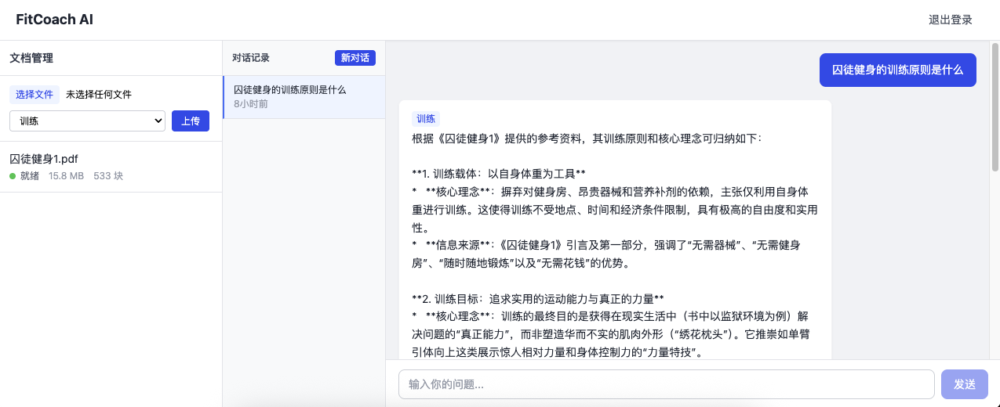
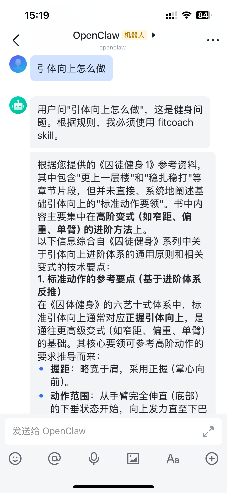

# FitCoach AI


**Upload any fitness book, get expert answers with page-level citations — powered by a multi-agent RAG system.**

## Screenshots

### Web Interface


### Feishu Bot Integration


---

## Architecture

```
Host Machine (Mac Mini)
│
├── :3000  React Frontend
├── :8000  FastAPI Backend
│
Docker Internal Network (fitcoach-net)
│
├── postgres:5432   PostgreSQL 16 + pgvector
├── redis:6379      Redis 7 (cache + rate limiter)
│
External
├── LLM Provider    OpenAI-compatible (DeepSeek / OpenAI / etc.)
└── Ollama :11434   Embedding model (nomic-embed-text, host machine)
```

```
User (Web / Feishu)
       │
       ▼
  FastAPI :8000
       │
  ┌────┴─────────────────────────┐
  │         LangGraph             │
  │  ┌─────────────────────────┐  │
  │  │       Router Agent      │  │
  │  └──┬──────────┬───────┬───┘  │
  │     ▼          ▼       ▼      │
  │  Training   Rehab  Nutrition  │
  │   Agent     Agent    Agent    │
  │     │          │       │      │
  │     └──────────┴───────┘      │
  │              │                │
  │         pgvector RAG          │
  └─────────────────────────────-─┘
       │
  LLM Provider API
```

**Request flow:**
1. User sends a chat message
2. Router Agent classifies intent → training / rehab / nutrition
3. Specialist Agent retrieves relevant chunks from pgvector (filtered by `content_domain`)
4. LLM generates answer grounded in retrieved passages with citations
5. Response cached in Redis; subsequent identical queries served from cache

---

## Architecture Rationale

- **Supervisor-Worker (LangGraph) vs. Single Agent**: 
  - *Problem*: A single agent often suffers from "intent drift" and context pollution when handling diverse fitness domains (e.g., mixing rehab precautions with hypertrophy volume).
  - *Decision*: Separate specialized agents (Training, Rehab, Nutrition) coordinated by a Supervisor Router.
  - *Why*: Ensures domain isolation, reduces prompt complexity, and allows for specialized retrieval strategies per domain.

- **pgvector vs. Dedicated Vector DB (Chroma/Pinecone)**:
  - *Problem*: Maintaining a separate relational DB for users/conversations and a standalone vector DB increases operational overhead and risk of data desync.
  - *Decision*: Use PostgreSQL with the `pgvector` extension.
  - *Why*: Unified ACID-compliant storage for both relational data and embeddings; simplified backup/restore; single source of truth.

- **Decoupled Embedding vs. Chat Models**:
  - *Problem*: Tying embedding and chat to the same provider (e.g., pure OpenAI) limits cost-efficiency and performance optimization.
  - *Decision*: Independent service layers for Embedding (local Ollama) and LLM (remote DeepSeek/OpenAI).
  - *Why*: Allows using fast, zero-cost local embeddings for bulk PDF processing while leveraging high-reasoning remote models for final answer generation.

---

## Tech Stack

| Layer | Technology |
|-------|-----------|
| Frontend | React 18, Vite 5, TailwindCSS, Zustand |
| Backend | Python 3.11, FastAPI, LangChain, LangGraph |
| Database | PostgreSQL 16 + pgvector (HNSW index) |
| Cache | Redis 7 |
| Auth | JWT (python-jose + bcrypt) |
| PDF Parsing | PyMuPDF + pdfplumber |
| Embedding | OpenAI-compatible (Ollama `nomic-embed-text` on Mac Mini) |
| LLM | OpenAI-compatible (DeepSeek / OpenAI; Claude via LiteLLM proxy) |
| Feishu bot | OpenClaw + SKILL.md + `ask-fitcoach.py` |

---

## Quick Start

### Prerequisites

- Docker + Docker Compose
- Ollama running on the host with `nomic-embed-text` pulled:
  ```bash
  ollama pull nomic-embed-text
  ```

### 1. Configure environment

```bash
cp .env.example .env
```

Edit `.env` — minimum required fields:

```env
# LLM (DeepSeek example)
LLM_API_KEY=sk-xxxxxxxxxxxx
LLM_BASE_URL=https://api.deepseek.com/v1
LLM_CHAT_MODEL=deepseek-chat

# Embedding (Ollama on host machine)
EMBEDDING_API_KEY=ollama
EMBEDDING_BASE_URL=http://host.docker.internal:11434/v1
EMBEDDING_MODEL=nomic-embed-text
EMBEDDING_DIMENSION=768

# Auth
JWT_SECRET=<random string>

# Feishu bot (optional)
BOT_API_KEY=<openssl rand -hex 32>
BOT_USER_ID=<UUID from bot account registration>
```

### 2. Start services

```bash
docker compose up -d
```

### 3. Verify

```bash
curl http://localhost:8000/health
```

Expected:
```json
{"status": "healthy", "services": {"database": {"status": "up"}, "redis": {"status": "up"}}}
```

Web UI: http://localhost:3000
API docs: http://localhost:8000/docs

---

## API Overview

Base URL: `http://localhost:8000/api/v1`

### Auth

| Method | Path | Description |
|--------|------|-------------|
| POST | `/auth/register` | Create account |
| POST | `/auth/login` | Obtain JWT (OAuth2 form) |

### Documents

| Method | Path | Description |
|--------|------|-------------|
| POST | `/documents/upload` | Upload PDF (`multipart/form-data`; include `domain=training\|rehab\|nutrition`) |
| GET | `/documents` | List uploaded documents |
| GET | `/documents/{id}` | Document detail + processing status |
| DELETE | `/documents/{id}` | Delete document and all chunks |

> **Important:** Always specify `domain` when uploading. Without it, RAG retrieval returns empty results.

### Chat

| Method | Path | Description |
|--------|------|-------------|
| POST | `/chat` | Send message, receive SSE stream |
| GET | `/conversations` | List conversations |
| GET | `/conversations/{id}` | Full conversation history |
| DELETE | `/conversations/{id}` | Delete conversation |

### System

| Method | Path | Description |
|--------|------|-------------|
| GET | `/health` | Service health (DB + Redis probe) |

### OpenAI-compatible endpoint (Feishu bot)

| Method | Path | Description |
|--------|------|-------------|
| POST | `/v1/chat/completions` | OpenAI-compatible chat; authenticated via `BOT_API_KEY` |

Full interactive API docs at **http://localhost:8000/docs**.

---

## Feishu / OpenClaw Integration

See [`docs/feishu-openclaw-integration.md`](docs/feishu-openclaw-integration.md) for the complete setup guide, including:
- Environment variables
- OpenClaw `openclaw.json` configuration (including required `tools` field)
- SKILL.md routing rules
- Bot account registration
- PDF upload workflow
- Security considerations

---

## Project Structure

```
fitcoach-ai/
├── docker-compose.yml
├── .env.example
├── Makefile
├── README.md
│
├── backend/
│   ├── Dockerfile
│   ├── requirements.txt
│   └── app/
│       ├── main.py          # FastAPI app + health check
│       ├── config.py        # pydantic-settings configuration
│       ├── deps.py          # Dependency injection (DB, Redis, current user)
│       ├── models/          # SQLModel table definitions
│       ├── schemas/         # Pydantic request/response schemas
│       ├── api/             # Route handlers (auth, documents, chat, compat)
│       ├── agents/          # LangGraph graph + Router + Specialist agents
│       ├── rag/             # pgvector retriever
│       └── services/        # Business logic (document pipeline, embedding)
│
├── frontend/
│   ├── Dockerfile
│   └── src/
│       ├── components/      # React UI components
│       ├── store/           # Zustand state management
│       └── api/             # Axios API client
│
├── mcp/
│   ├── ask-fitcoach.py      # CLI script called by OpenClaw SKILL.md
│   └── fitcoach-mcp-server.js  # MCP server (alternative integration)
│
├── scripts/
│   └── init.sql             # DB initialization (pgvector extension + tables)
│
└── docs/
    ├── dev-doc-v1.3.md              # Full development specification
    └── feishu-openclaw-integration.md  # Feishu/OpenClaw setup guide
```

---

## Development

```bash
# Run backend tests
make test

# View backend logs
docker compose logs -f backend

# Clear Redis cache
docker compose exec redis redis-cli FLUSHALL

# Re-process all documents (after embedding config change)
docker compose exec backend python -m app.scripts.reprocess
```

---

## Known Limitations

- **Feishu + GLM tool-calling**: `zai/glm-4.7` requires `tools.allow: [exec, shell, bash]` in `openclaw.json` to execute SKILL.md bash commands. This introduces shell execution privileges on the host machine. See security notes in the Feishu integration guide.
- **Non-fitness questions**: The Router Agent routes to training/rehab/nutrition only. Questions outside these domains currently receive a "no relevant content" response.
- **Single-user embedding model**: All users share the same Ollama instance on the host; no embedding model fallback if Ollama is down.

---

## Roadmap

- **Enhanced Multi-turn Context**: Implement a windowed memory or summarization strategy in LangGraph to maintain deeper conversation state without exceeding LLM context limits.
- **Two-stage Retrieval (Re-ranker)**: Add a Cross-Encoder re-ranking step after the initial vector search to improve precision and ensure the top 3-5 chunks are the most relevant to the query.
- **Feedback-driven Optimization**: Add a "thumbs up/down" UI to collect user feedback on answer quality, enabling automated evaluation of retrieval performance and iterative tuning of chunking strategies.
- **Support for Scanned PDFs (OCR)**: Integrate an OCR engine (e.g., Tesseract or Azure Document Intelligence) to handle scanned images and low-quality PDF inputs effectively.

